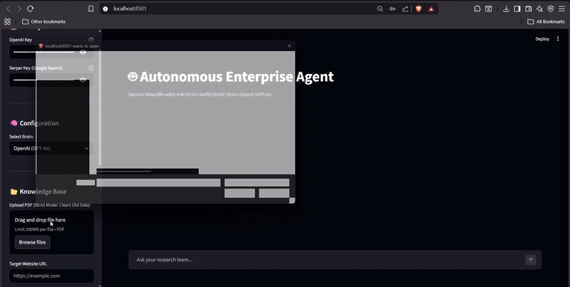
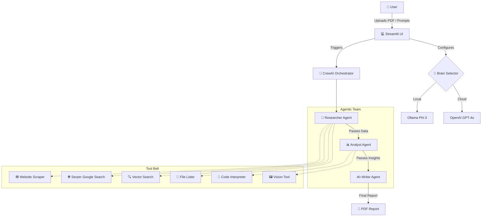
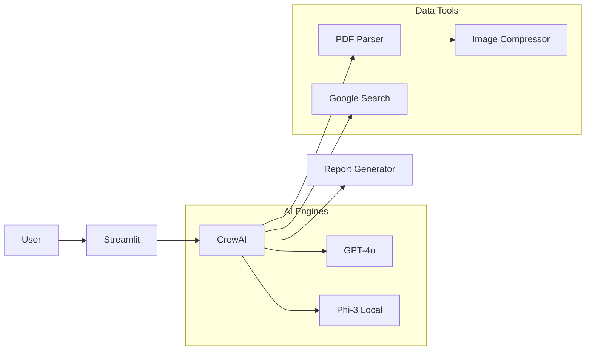

# 🤖 Autonomous Enterprise Research Agent


> **A production-grade, multi-modal autonomous agent capable of synthesizing proprietary internal data (PDFs) with real-time web intelligence to generate professional business reports.**

---

## 📸 Project Showcase

| **Multi-Modal Analysis (Vision RAG)** | **Real-Time Web Search** |
|:-------------------------------------:|:----------------------------------:|
|  |  |
| *Extracts and analyzes charts from PDFs* | *Fetches live financial/market data* |

| **Local LLM Support (Privacy)** | **Website Scraping** |
|:-------------------------------------:|:----------------------------------:|
|  |  |
| *Runs offline on local hardware via Ollama* | *Reads and summarizes specific URLs* |

---

## 🚀 Key Features

* **🧠 Hybrid Brain Architecture:** Seamlessly switch between **Cloud (GPT-4o)** for high-fidelity reasoning and **Local (Phi-3 via Ollama)** for privacy and cost-savings.
* **👁️ Multi-Modal RAG (Vision + Text):** Unlike standard RAG, this agent detects images in PDFs, extracts them, and uses Vision Language Models (VLM) to interpret charts and diagrams.
* **🌍 Active Web Connection:** Equipped with **Serper (Google Search)** and **Website Scraping** tools to verify internal data against live internet sources.
* **🛡️ Strict Data Isolation:** Implements a "Strict Mode" that auto-wipes previous session data upon new file uploads to prevent context bleeding and ensure security.
* **📂 Code Interpreter:** Embedded Python REPL allows the agent to write and execute code for precise data calculation and tabulation.

---

## 🏗️ System Architecture

The system uses **CrewAI** to orchestrate a hierarchical team of agents. The flow is dynamic based on user configuration (e.g., if "Vision" is disabled, the Vision Tool is removed from the Researcher's toolkit to save resources).


# 🛠️ Tech Stack

> A detailed breakdown of the technologies, libraries, and frameworks powering the **Autonomous Enterprise Research Agent**.

---

## 🐍 Core Runtime & Language
| Technology | Badge | Description |
| :--- | :--- | :--- |
| **Python** |  | The backbone of the application. Chosen for its extensive ecosystem in AI, Data Science, and PDF processing. |

---

## 🧠 Artificial Intelligence (The Brains)
| Technology | Badge | Role in Project |
| :--- | :--- | :--- |
| **CrewAI** |  | **Agent Orchestrator.** Manages the hierarchical team (Researcher, Analyst, Writer), delegates tasks, and handles inter-agent communication. |
| **LangChain** |  | **Logic Layer.** Provides the underlying chain management and tool interfaces used by CrewAI agents. |
| **OpenAI GPT-4o** |  | **Primary Intelligence.** Handles complex reasoning, high-fidelity vision analysis, and final report generation. |
| **Ollama** |  | **Local Inference Engine.** Powers the "Privacy Mode" by running the **Microsoft Phi-3** model locally on your machine. |
| **Microsoft Phi-3** |  | **Local Model.** A lightweight (3.8B param) model chosen for high performance on consumer hardware (8GB-16GB RAM). |

---

## 💻 User Interface (The Face)
| Technology | Badge | Role in Project |
| :--- | :--- | :--- |
| **Streamlit** |  | **Application UI.** Renders the chat interface, file uploader, sidebar configurations, and real-time agent status updates. |

---

## 👁️ Computer Vision & Data Processing
| Technology | Badge | Role in Project |
| :--- | :--- | :--- |
| **PyMuPDF (Fitz)** |  | **Extraction Engine.** High-speed extraction of text, metadata, and raw image bytes from uploaded PDF documents. |
| **Pillow (PIL)** |  | **Image Optimization.** Resizes and compresses extracted charts (to <800px) to prevent API token overflow errors (Fixes 429 error). |
| **LiteLLM** |  | **Model Abstraction.** Standardizes API calls, allowing the system to switch between OpenAI and Ollama seamlessly. |

---

## 🌍 External Intelligence (The Tools)
| Technology | Badge | Role in Project |
| :--- | :--- | :--- |
| **Serper Dev** |  | **Web Search Tool.** Allows the Researcher agent to perform live Google searches for real-time stock prices, news, and facts. |
| **ScrapeWebsiteTool**|  | **Content Reader.** Enables the agent to visit specific URLs provided by the user and summarize their content. |

---

## 📂 Utilities & Infrastructure
* **`python-dotenv`**: Manages sensitive API keys (OpenAI, Serper) securely via `.env` files.
* **`FPDF`**: Generates the final, downloadable professional PDF report from the agent's markdown output.
* **`JSON`**: Handles the persistent storage for the "Long Term Memory" (Chat History) feature.

---

## 🧬 System Dependency Graph


## ⚙️ Installation & Setup

### 1️⃣ Clone Repository
```bash
git clone https://github.com/yourusername/autonomous-enterprise-researcher.git
cd autonomous-enterprise-researcher
```

### 2️⃣ Virtual Environment
```bash
python -m venv venv
# Windows
venv\Scripts\activate
# Mac/Linux
source venv/bin/activate
```
### 3️⃣ Install Dependencies
```bash
pip install -r requirements.txt
```
##⚠️ Ensure litellm and crewai-tools are included

## 🤖 Local LLM Setup (Ollama)

### Why Phi-3?
Lightweight, fast, and runs smoothly on **8–16GB RAM** systems.

### Install Ollama
👉 https://ollama.com

### Pull Model
```bash
ollama pull phi3
```

### Start Server
```bash
ollama serve
```
## 🚦 Usage

### Run App
```bash
streamlit run app.py
```
### Sidebar Configuration
- 🔑 **API Keys** – OpenAI (Cloud) & Serper (Web)
- 🧠 **Brain Selection** – Local (Phi-3) or Cloud (GPT-4o)
- 📎 **Upload PDF** – Drag & drop

### Example Queries
- “Analyze the growth trend in Figure 1”
- “Search the web for NVIDIA’s latest stock price”

### Export
- 📥 **Download Report** → Clean PDF summary

## 📂 Project Structure

```text
autonomous-enterprise-researcher/
├── data/                   # Uploaded PDFs (auto-cleared)
├── extracted_images/       # Temp chart & image storage
├── app.py                  # Streamlit entry point
├── analysis_tools.py       # Custom tools (Vision, PDF, Code)
├── tools.py                # CrewAI tool configuration
├── chat_history.json       # Local chat persistence
├── requirements.txt        # Dependencies
└── README.md               # Documentation
```


## 🔮 Future Roadmap
- [ ] 🎙️ **Voice Interface** – Add `st.audio_input` for voice-to-text querying
- [ ] 🐳 **Docker Support** – Containerize the application for easy deployment
- [ ] 📚 **Multi-Document Compare** – Analyze multiple PDFs simultaneously

---

## 📄 License
Distributed under the **MIT License**.  
See `LICENSE` for more information.

---

### ❤️ Built with love by **Mohit**
